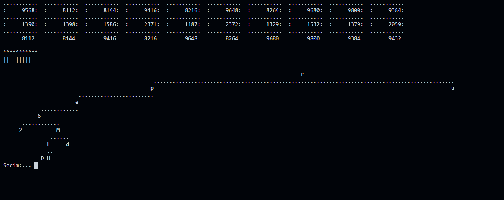
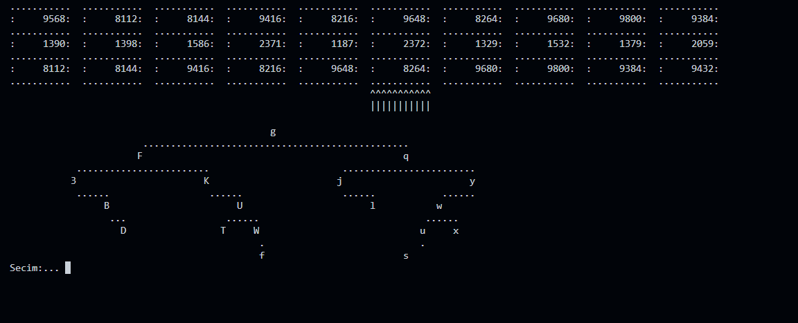

# Veri Yapilari 2. Odev

Bu proje, `agaclar.txt` dosyasindaki her satiri bir ikili arama agacina (BST) ceviren ve bu agaclari tek yonlu bagli listede tutan C++ konsol uygulamasidir.

Program her agac icin dugum adresini, toplam degeri ve sonraki dugum adresini ekrana yazdirir. Secili agacin yapisi konsolda gosterilir.

## Ekran Goruntuleri

Asagidaki ekranlar programin baslangic durumunu ve calisma sirasindaki ilerleme ciktilarini gosterir.

<p align="center">
  
  
</p>

## Klasor Yapisi

- `src/`: Kaynak dosyalar
- `include/`: Baslik dosyalari
- `bin/`: Derlenmis programin olustugu klasor
- `lib/`: Nesne dosyalarinin olustugu klasor
- `doc/`: Odev raporu
- `agaclar.txt`: Programin okudugu veri dosyasi
- `makefile`: Derleme ve calistirma komutlari

## Derleme

MinGW veya benzeri bir ortamda `g++` ve `make` kurulu olmalidir.

Sadece derlemek icin:

```sh
mingw32-make compile
```

veya:

```sh
make compile
```

## Calistirma

Derledikten sonra Windows uzerinde:

```sh
.\bin\Program.exe
```

Makefile ile derleyip calistirmak icin:

```sh
mingw32-make
```

## Kontroller

- `d`: Sonraki agaca gec
- `a`: Onceki agaca gec
- `w`: Secili agaci aynala
- `s`: Secili agaci listeden sil
- `x`: Programdan cik
