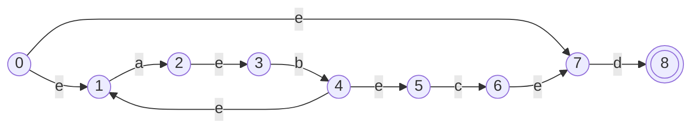

# Programlama Dillerin Prensipleri - Ikinci Odevi

Formal languages and automata theory coursework project implemented with C++ and Java. The repository demonstrates core finite-automata operations: epsilon-NFA to DFA conversion, DFA minimization, and NFA to regular-expression conversion with the Kleene state-elimination method.

## Project Overview

This project is designed as a source-first educational repository. Each program uses a small sample automaton and prints the generated states, transitions, minimized machine, or final regular expression so the algorithm can be followed from the terminal.

The project includes:

- C++ implementation of epsilon-NFA to DFA conversion.
- Java implementation of epsilon-NFA to DFA conversion.
- C++ implementation of DFA minimization.
- C++ implementation of NFA to regular expression conversion.
- Windows and Linux/macOS build scripts.
- Optional CMake support for the C++ examples.
- GitHub Actions validation for fresh-clone builds and smoke tests.

## Algorithms

### 1. NFA to DFA Conversion

The NFA examples use `e` as the epsilon transition symbol. The conversion process:

1. Calculates the epsilon closure of the NFA start state.
2. Treats each set of NFA states as one DFA state.
3. Follows all matching transitions for every input symbol.
4. Applies epsilon closure after every move.
5. Marks every DFA state that contains an original NFA final state as final.

Source files:

- `cpp/nfa_to_dfa.cpp`
- `java/src/VM_odev/NfaToDfa.java`

### 2. DFA Minimization

The minimization example reduces a DFA by:

1. Removing unreachable states.
2. Splitting reachable states into final and non-final partitions.
3. Repeatedly refining partitions according to transition behavior.
4. Building a smaller equivalent DFA from the final partitions.

Source file:

- `cpp/dfa_minimization.cpp`

### 3. NFA to Regular Expression

The Kleene/state-elimination example converts an NFA to a regular expression by:

1. Adding a new artificial start state and final state.
2. Labeling transitions with regular-expression fragments.
3. Eliminating intermediate states one by one.
4. Combining paths with union, concatenation, and Kleene star.
5. Printing the final expression from the new start to the new final state.

Source file:

- `cpp/kleene_regex.cpp`

## Sample Automaton



## Project Structure

```text
.
|-- cpp/
|   |-- dfa_minimization.cpp
|   |-- kleene_regex.cpp
|   `-- nfa_to_dfa.cpp
|-- java/
|   `-- src/
|       `-- VM_odev/
|           `-- NfaToDfa.java
|-- scripts/
|   |-- build.ps1
|   `-- build.sh
|-- docs/
|   `-- github-description.md
|-- .github/
|   `-- workflows/
|       `-- build.yml
|-- CMakeLists.txt
`-- README.md
```

## Requirements

- `g++` with C++11 support.
- Java JDK 17 or newer.
- Optional: CMake 3.12 or newer.

## Quick Start

Clone the repository:

```bash
git clone https://github.com/ahmed3bahaa/Programmlama-dillerin-prensiplerin-ikinci-odevi.git
cd Programmlama-dillerin-prensiplerin-ikinci-odevi
```

### Windows

Build all examples:

```powershell
powershell -ExecutionPolicy Bypass -File .\scripts\build.ps1
```

Run the C++ examples:

```powershell
.\build\cpp\nfa_to_dfa.exe
.\build\cpp\dfa_minimization.exe
.\build\cpp\kleene_regex.exe
```

Run the Java example:

```powershell
java -cp build\java VM_odev.NfaToDfa
```

### Linux/macOS

Build all examples:

```bash
bash scripts/build.sh
```

Run the C++ examples:

```bash
./build/cpp/nfa_to_dfa
./build/cpp/dfa_minimization
./build/cpp/kleene_regex
```

Run the Java example:

```bash
java -cp build/java VM_odev.NfaToDfa
```

### Optional CMake Build

```bash
cmake -S . -B build/cmake
cmake --build build/cmake
```

## Example Output

The programs print:

- Generated DFA state sets.
- DFA transition tables.
- Final states after conversion.
- Minimized DFA states and transitions.
- A generated regular expression for the sample NFA.

## GitHub Deployment

This is a command-line coursework project, so deployment means publishing a clean, reproducible source repository to GitHub instead of hosting a web application. The deployed repository contains source code, documentation, build scripts, repository metadata, and a GitHub Actions workflow.

Recommended GitHub About description:

```text
Formal languages automata project with C++ and Java examples for NFA-to-DFA conversion, DFA minimization, and NFA-to-regex state elimination.
```

Recommended topics:

```text
formal-languages, automata-theory, nfa, dfa, regular-expression, state-elimination, cpp, java, compiler-design, coursework
```

## Validation

The repository can be validated locally with:

```powershell
powershell -ExecutionPolicy Bypass -File .\scripts\build.ps1
.\build\cpp\nfa_to_dfa.exe
.\build\cpp\dfa_minimization.exe
.\build\cpp\kleene_regex.exe
java -cp build\java VM_odev.NfaToDfa
```

GitHub Actions runs the same kind of build and smoke-test process on every push and pull request.

## License

No license has been specified yet. Add a license before reuse or distribution outside coursework.
